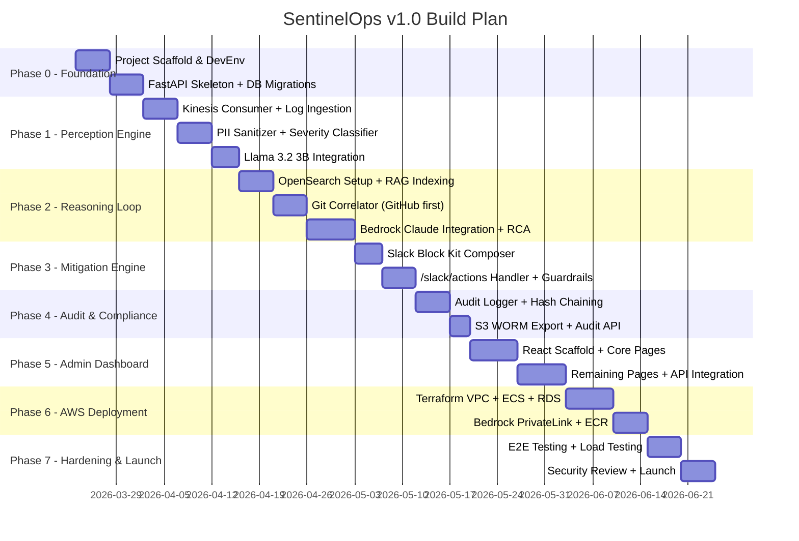
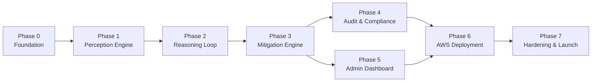

# SentinelOps v1.0 — Phase Build Plan

**Total Duration:** ~18 weeks  
**Team:** Solo / Small team (1–3 engineers)  
**Approach:** Build → Test → Deploy in thin vertical slices. Each phase produces a working, testable artifact.

---

## Phase Overview



---

## Phase 0 — Foundation (Weeks 1–2)

**Goal:** Working local dev environment. Every engineer can run the stack in <5 minutes.

### Deliverables
- [x] Git repo initialized with folder structure from Tech Spec
- [x] Python 3.12 venv + `requirements.txt` (FastAPI, SQLAlchemy, alembic, boto3, slack-sdk, pytest)
- [x] FastAPI skeleton: `main.py` with health check `GET /health`
- [x] Docker Compose: PostgreSQL 16 + pgAdmin for local dev
- [x] Alembic migrations: `incidents`, `rca_reports`, `audit_log`, `repositories`, `guardrail_rules` tables
- [x] `.env.example` with all variables documented
- [x] GitHub Actions CI: lint (ruff + mypy) + pytest on every PR
- [x] README with quickstart instructions

### Test Gate
```bash
uvicorn agent.main:app --reload
curl http://localhost:8000/health  # → {"status": "healthy"}
alembic upgrade head               # → all 5 tables created
```

---

## Phase 1 — Perception Engine (Weeks 3–5)

**Goal:** Log events flow in → classified → severity dispatched. Fully testable with mock logs.

### Deliverables
- [x] Kinesis Firehose consumer (`consumer.py`) — async batch polling loop
- [x] Mock log generator for local testing (simulates SEV-1/2/3 log batches)
- [x] PII sanitizer (`pii_sanitizer.py`) — regex + pattern matching for all PII types
- [x] Severity classifier (`severity.py`) — rule-based fallback (regex thresholds)
- [x] `POST /internal/incident` endpoint on Agent Controller
- [x] Llama 3.2 3B inference server (`perception-engine/server.py`) with FastAPI wrapper
- [x] Integration: Perception Engine → Agent Controller HTTP call
- [x] Unit tests: PII sanitizer (assert no PII leaks), severity classifier, Kinesis consumer

### Test Gate
```bash
# Simulate a SEV-1 incident end-to-end (locally, no AWS needed)
python tests/mock_incident_generator.py --severity SEV1
# → /internal/incident receives payload
# → Audit log records TRIAGE_DECISION event
```

### Key Design Decision
The Llama 3B model runs as a **separate FastAPI process** on the same EC2 instance in prod, but as a local Docker container in dev. The Agent Controller calls it via HTTP — decoupled, independently restartable.

---

## Phase 2 — Reasoning Loop (Weeks 6–8)

**Goal:** Given an incident summary, produce a fully structured RCA JSON using Bedrock + RAG + Git.

### Deliverables
- [ ] OpenSearch Serverless index created with k-NN mapping (or local OpenSearch via Docker for dev)
- [ ] RAG indexer: script to ingest runbooks/historical incidents into vector index
- [ ] `vector_retrieval.py` — embed incident + query top-5 similar past incidents
- [ ] `git_correlator.py` — GitHub API client; fetch PRs merged in last 24h across registered repos
- [ ] `bedrock_client.py` — Claude 3.5 Sonnet invocation via boto3 with RCA prompt template
- [ ] `orchestrator.py` — `asyncio.gather()` for parallel RAG + Git retrieval
- [ ] RCA JSON validated against schema (pydantic model)
- [ ] `POST /api/incidents/:id/rca` populated and queryable
- [ ] Unit tests: mock Bedrock response, assert RCA matches schema; mock GitHub API

### Test Gate
```bash
# Trigger mock SEV-1 → full reasoning loop
curl -X POST http://localhost:8000/internal/incident -d @tests/mock_sev1.json
# → RCA JSON stored in DB
curl http://localhost:8000/api/incidents/test-001/rca
# → Full RCA with five_whys + action_items
```

### Key Design Decision
In local dev, Bedrock is called with **real AWS credentials** (cheapest test = Claude Haiku for dev, Sonnet for prod). Use `AWS_PROFILE=sentinelops-dev` with a least-privilege IAM user.

---

## Phase 3 — Mitigation Engine + Slack (Weeks 9–10)

**Goal:** RCA → Slack alert with interactive buttons → human approval → action dispatched.

### Deliverables
- [ ] Slack App created in dev workspace (free tier)
- [ ] `slack_notifier.py` — Block Kit composer; posts RCA alert to `#incidents` channel
- [ ] `POST /slack/actions` webhook handler — HMAC-SHA256 signature verification
- [ ] Guardrail Layer 1 (`guardrails.py`) — hard gate checks before any action
- [ ] `executor.py` — handles `approve_rollback`, `create_jira`, `dismiss` actions
- [ ] Jira API client (`create_issue` from RCA data)
- [ ] ngrok tunnel wired to local FastAPI for Slack callback testing
- [ ] Audit events: `ALERT_SENT`, `HUMAN_DECISION`, `GUARDRAIL_TRIGGERED`, `MITIGATION_EXECUTED`
- [ ] E2E test: mock incident → Slack alert → simulate button click → verify audit log

### Test Gate
```bash
ngrok http 8000  # Paste URL → Slack App Interactivity settings
# 1. Trigger mock incident
# 2. See Slack Block Kit alert appear in #incidents
# 3. Click [Approve Rollback]
# 4. See "✅ Rollback approved" response in Slack
# 5. Verify audit log has HUMAN_DECISION record
```

---

## Phase 4 — Audit & Compliance (Weeks 11–12)

**Goal:** Every event immutably logged, hash-chained, and archivable to S3 WORM.

### Deliverables
- [ ] `logger.py` — append-only audit writer; computes SHA-256 hash chain
- [ ] `hasher.py` — standalone hash chain verification utility
- [ ] All modules instrumented: every event type from the audit table logged correctly
- [ ] `GET /api/audit` endpoint with full filtering (actor, date range, event type)
- [ ] S3 export job: daily batch export of audit records to `.ndjson` (with Object Lock config in Terraform)
- [ ] Audit integrity checker: CLI tool that verifies the full hash chain is unbroken
- [ ] Unit tests: hash chain integrity, verify no gaps in event coverage

### Test Gate
```bash
# Verify hash chain integrity across all audit records
python tools/verify_audit_chain.py
# → "✅ All 47 audit records verified. Chain intact."

# Export audit bundle for an incident
curl "http://localhost:8000/api/audit?incident_id=test-001&format=json" -o audit_bundle.json
```

---

## Phase 5 — Admin Dashboard (Weeks 12–14)

**Goal:** Engineers can configure, monitor, and audit SentinelOps via a web UI.

### Deliverables
- [ ] React + Vite + Tailwind project scaffolded (`dashboard/`)
- [ ] Auth: Cognito-backed login (or mock auth for dev)
- [ ] **Incident Feed** (`/incidents`) — live list with SEV badges, status, service name
- [ ] **Incident Detail** (`/incidents/:id`) — full RCA, 5 Whys, action items, timeline
- [ ] **Reasoning Trace** (`/incidents/:id/trace`) — CoT debug view
- [ ] **Audit Trail** (`/audit`) — filterable table, export to JSON/PDF button
- [ ] **Repository Manager** (`/repos`) — add/remove repos; auth token stored via `/api/repositories`
- [ ] **Guardrail Config** (`/guardrails`) — add/remove No-Go zones; confidence slider
- [ ] **Knowledge Base** (`/knowledge`) — file upload for RAG source docs
- [ ] **Token Spend** (`/spend`) — chart of Bedrock tokens per incident + monthly total

### Test Gate
- Manually walk through every page; verify data loads correctly from API
- Register a GitHub repo → trigger mock incident → confirm it appears in the Incident Feed

---

## Phase 6 — AWS Deployment (Weeks 15–16)

**Goal:** Full stack running in production AWS VPC. No local dependencies.

### Deliverables
- [ ] Terraform: VPC, private subnets, security groups
- [ ] Terraform: ECS Fargate (Agent Controller + Dashboard), multi-AZ
- [ ] Terraform: EC2 c5.2xlarge for Perception Engine (user-data script: install Python, load Llama 3B)
- [ ] Terraform: RDS PostgreSQL Multi-AZ
- [ ] Terraform: OpenSearch Serverless (k-NN enabled)
- [ ] Terraform: S3 bucket with Object Lock (Compliance mode, 5yr retention)
- [ ] Bedrock VPC PrivateLink endpoint
- [ ] ECR private registry + Docker image push for Agent Controller + Dashboard
- [ ] AWS Secrets Manager: all credentials migrated from `.env`
- [ ] CloudWatch alarms: ECS task health, RDS failover, Kinesis lag
- [ ] GitHub Actions: deploy to ECS on merge to `main`

### Test Gate
```bash
# Smoke test against production endpoint
curl https://<internal-alb-url>/health  # → healthy
# Trigger real SEV-2 incident via CloudWatch test log
# Verify Slack alert arrives within 3 minutes
```

---

## Phase 7 — Hardening & Launch (Weeks 17–18)

**Goal:** Production-ready. Compliant. Performant. Documented.

### Deliverables
- [ ] **Load Test:** Simulate 50,000 log events/min via Locust; assert triage latency < 30s P95
- [ ] **E2E Test Suite:** Full pipeline from mock log → Slack alert → human approval → audit verification
- [ ] **Security Review:**
  - Penetration test on `/slack/actions` (HMAC bypass attempts)
  - Verify no PII in any DB column that crosses VPC (random sampling of audit records)
  - IAM permission audit (all roles at least-privilege)
- [ ] **Chaos Testing:** Kill Perception Engine → verify fallback to rule-based detection; kill Bedrock endpoint → verify graceful degradation message in Slack
- [ ] **Runbook:** Ops runbook for on-call (how to restart services, check audit chain, rotate secrets)
- [ ] **Launch Checklist:** All KPIs from PRD Section 11 measured and baseline established

---

## Dependency Map



> Note: **Phase 4 and 5 can be parallelized** if there are 2 engineers — one on audit hardening, one on the dashboard.

---

## Tech Risk Register

| Risk | Likelihood | Impact | Mitigation |
|---|---|---|---|
| Llama 3B accuracy < 90% on production logs | Medium | High | Fine-tune on 500 real log samples in Phase 1; fallback to rule-based always available |
| Bedrock cold-start latency spikes | Low | Medium | Measure P99 in Phase 6; switch to Claude Haiku for triage if needed |
| Slack rate limiting during incident storm | Medium | Medium | Implement exponential backoff queue in Phase 3 |
| PII leak through sanitizer | Low | Critical | Automated PII scanner in CI pipeline from Phase 1 onward |
| RDS failover causes audit gap | Low | High | In-memory queue (500 records) implemented in Phase 4 |

---

## Cost Estimate (Monthly, Production)

| Component | Cost |
|---|---|
| EC2 c5.2xlarge (Perception Engine, always-on) | ~$245 |
| ECS Fargate (Agent Controller, 2 tasks) | ~$60 |
| RDS PostgreSQL Multi-AZ (db.t3.medium) | ~$60 |
| OpenSearch Serverless (light usage) | ~$25 |
| Bedrock Claude 3.5 Sonnet (~200 incidents/mo) | ~$10–40 |
| S3 + Data Transfer | ~$5 |
| **Total** | **~$395–425/mo** |
